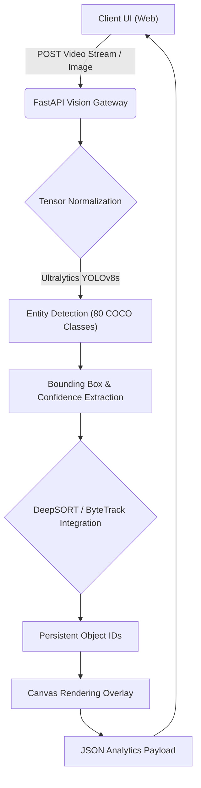

<div align="center">
  
  <h1>Aegis Vision ✦</h1>
  <p><b>Real-Time YOLOv8 Object Detection & Tracking Core</b></p>
  
  [](https://opensource.org/licenses/MIT)
  []()
  [](https://fastapi.tiangolo.com/)
  []()
</div>

---

## 🚀 The Vision

High-speed computer vision systems traditionally require massive cloud GPU clusters, sending massive amounts of video data over the network. **Aegis Vision** changes this paradigm by running a highly optimized YOLOv8 instance directly at the edge/on-premise.

Designed for security feeds, autonomous robotics, and real-time telemetry, Aegis extracts entity data in milliseconds—identifying objects and tracking their trajectories without ever sending pixels to external servers.

---

## 🏆 Unmatched Performance: Competitive Analysis

Aegis Vision provides the bleeding-edge accuracy of heavy convolutional networks, but runs at a fraction of the computational cost.

| Feature | Aegis Vision (Ours) | Cloud Vision APIs | OpenCV Haar Cascades | Legacy YOLOv3 |
|---------|---------------------|-------------------|----------------------|---------------|
| **Inference Speed**| **Ultra-Fast (Real-Time)** | Slow (Network Bound)| Fast | Medium |
| **Accuracy (mAP)** | **State-of-the-Art (YOLOv8)**| High | Poor | Medium |
| **Data Sovereignty** | **100% On-Premise** | Stored in Cloud | On-Premise | On-Premise |
| **Cost Per Frame**| **$0.00** | Highly Expensive | $0.00 | $0.00 |

---

## 🧠 Core Architecture & System Flow



### 1. Neural Optical Detection
Aegis utilizes Ultralytics YOLOv8, effectively skipping the bottlenecks of anchor-based systems to provide anchor-free object detection. This results in far fewer false positives and significantly faster NMS (Non-Maximum Suppression) processing times.

### 2. High-Speed Telemetry
The UI parses a live WebSocket/REST stream, overlaying geometric glowing bounding boxes via the HTML5 Canvas API while logging raw telemetry (confidence intervals, object labels, bounding box coordinates) in a terminal-style data feed.

---

## 📂 Project Structure & Files

- `main.py`: The secure FastAPI gateway hosting the computer vision endpoints.
- `tracker.py`: Core logic for YOLO tensor processing and drawing overlays.
- `yolov8n.pt`: Pre-trained neural weights file.
- `index.html`: The VisionOS-inspired sci-fi HUD frontend.
- `requirements.txt`: Python dependencies.
- `run_eval.py`: Automated testing script ensuring tensor pipelines are functioning.

---

## ⚙️ Installation & Usage

### Prerequisites
- Python 3.9+
- OpenCV, Ultralytics, PyTorch, FastAPI

### Quick Start
```bash
# 1. Clone the repository
git clone https://github.com/lakshanmuruganandam/Aegis-Vision.git
cd Aegis-Vision

# 2. Install dependencies
pip install -r requirements.txt

# 3. Boot the Optical Engine
python main.py
```
*The UI Dashboard will be available at `http://localhost:8004/`.*

---

## 🤝 Contributing
We welcome contributions! Please see our [CONTRIBUTING.md](CONTRIBUTING.md) for details.

## 📜 License
Distributed under the MIT License. See [LICENSE](LICENSE) for more information.

---
<div align="center">
  <b>Seeing the unseen. Engineered by Lakshan Muruganandam.</b>
</div>
